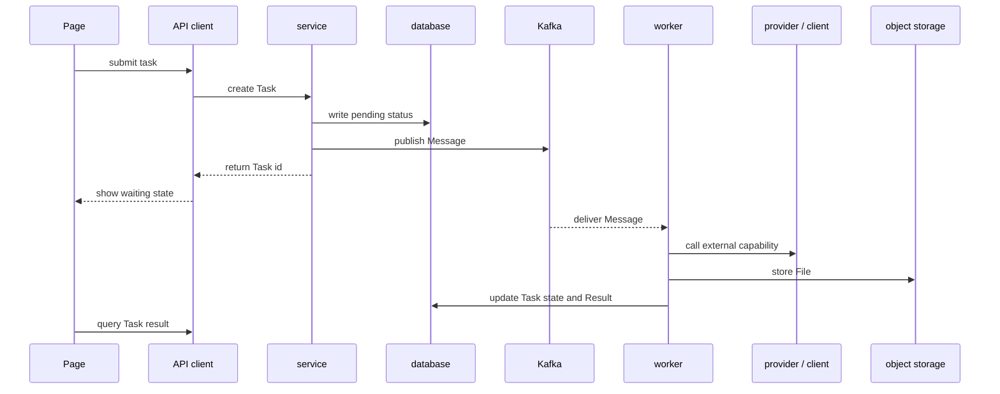
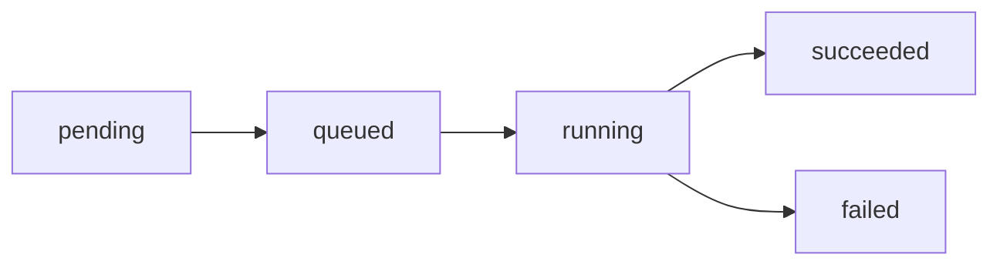

# Notes on a Frontend and Backend Architecture Flow

While maintaining a frontend and a Python backend, I started to understand frontend-backend separation more clearly.

It is not only about putting pages and APIs in different folders. The more important part is knowing what each layer owns, how data flows, which work should return synchronously, and which work should move into background processing.

## Technology Stack Overview

On the frontend side, I care more about the boundaries around pages, components, state, API clients, mocks, and proxies.

Pages organize user interactions, components handle reuse and display, state management keeps data changes predictable, and API clients keep request details in one place. When backend APIs change, request logic should not be scattered across the whole frontend.

On the backend side, the main stack is Python:

- FastAPI handles HTTP entry points and route organization.
- Pydantic describes request, response, and data structures.
- SQLAlchemy handles database models and queries.
- Alembic handles database migrations.
- PostgreSQL stores persistent data.
- Kafka moves long-running work out of synchronous requests.
- Object storage keeps large files such as images, videos, and generated results.
- Workers consume jobs, call external capabilities, and update task states.

Each tool can be understood on its own, but in a real system the important part is making them cooperate in one clear call chain.

## Backend Layers

I now prefer splitting backend responsibilities into entry points, structures, orchestration, storage, and external capabilities.

`router` is the HTTP entry point. It handles routes, request parameters, request context after authentication, and response exits. It should not contain too much concrete logic, or the system becomes hard to maintain once there are more APIs.

`schema` describes input and output. Its value is not only adding a few types, but making both frontend and backend understand what an API accepts, what it returns, and what error shapes roughly look like.

`service` holds the main orchestration. Creating tasks, checking status, writing to the database, and deciding whether to publish an async message should be organized here. This keeps routers thin and makes later tests or alternative entry points easier.

`model` maps to database structures. It should stay clear and stable. A temporary frontend display need should not casually reshape the storage model.

`provider` or `client` acts as an adapter for external capabilities. Whether it is a model service, file service, or another HTTP service, the platform differences should stay here instead of leaking everywhere into services.

`worker` handles asynchronous execution. It does not directly face user requests. Instead, it pulls work from a queue or task table, executes it, and writes the final state back.

## Frontend and Backend Request Flow

Normal APIs are suitable for a synchronous path. Querying a list, saving configuration, or loading detail data can usually return directly after the backend finishes processing.

In this flow, the frontend should not care how the database is queried, and the backend should not care where a button is placed. The real shared boundary is the API contract.

I think three things matter most here:

- Request parameters should be stable instead of making the frontend guess.
- Error shapes should be consistent instead of changing from endpoint to endpoint.
- Response data should fit page needs, but page state should not become the database structure.

## Kafka Async Flow

Some tasks should not keep an HTTP request waiting.

For example, work that calls external capabilities, processes files, generates results, uploads to object storage, or has unstable execution time is better split into two phases: creating the task and processing it in the background.

The point of this flow is not simply that Kafka is used. The value is moving slow and unstable work out of the user-facing request.

The HTTP request only confirms that the task has been created. The worker handles the real long-running work. After the frontend receives a task id, it only needs to display states such as waiting, processing, succeeded, or failed.

This has several benefits:

- The page is not blocked by a long request.
- The backend can control retry and failure states.
- Workers can scale independently.
- Large files and generated results can go into object storage instead of normal API responses.
- When debugging, the task state shows how far the flow has gone.

## State and Idempotency

When there are more async tasks, state design becomes important.

I prefer keeping task states clear, for example:

Each state should answer a question: where is the task now, what should the user see, and will the backend continue processing it.

Task creation and message consumption also need idempotency. Network retries, duplicated messages, and worker restarts can all happen. If the same message is consumed twice, the system should avoid producing two results or writing confusing states.

This can be reduced through task ids, state checks, unique constraints, and processing locks. The exact approach depends on the scenario, but the awareness itself matters.

## Frontend and Backend Boundaries

The more I maintain this kind of system, the more I care about boundaries.

The frontend should own:

- Page state and interaction rhythm.
- Form validation and basic hints.
- API client wrapping.
- Error display and loading state.
- Mock or proxy-based development experience.

The backend should own:

- Data structures and core rules.
- Permissions, state transitions, and consistency.
- Database reads and writes.
- External capability adapters.
- Async tasks, retries, and final states.

If the frontend copies backend rules just to finish a page quickly, the two sides can drift apart later. If the backend puts every display detail into APIs, the APIs also become hard to reuse.

A good boundary does not mean there is no overlap at all. It means knowing which parts can repeat a little, and which parts must have only one source of truth.

## My Current Understanding

The core of this architecture is not any single framework. It is whether the call flow can be explained clearly.

After a request leaves the page, which API client handles it, which router receives it, which service orchestrates it, what state is written, when a message is published, how the worker takes over, and how the result returns to the page should all be traceable.

If I can explain that path clearly, then I am not only changing one small piece of code. I understand why the system is split this way, where to look when something breaks, and where new capabilities should go later.

That is the most valuable thing I have learned while maintaining the frontend and Python backend.

:badge[Python] :badge[FastAPI] :badge[Kafka] :badge[Frontend Backend]
