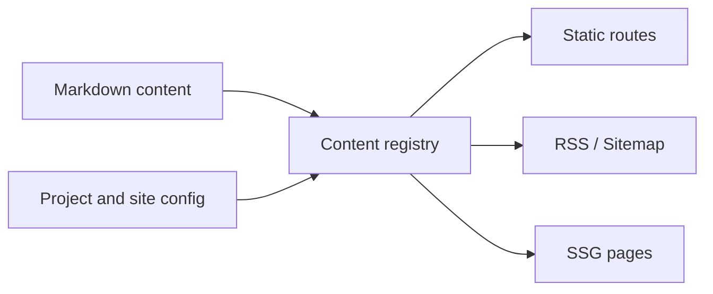

# Building This Bilingual Static Site

Ying Blog's implemented baseline is not about building a complex platform. It establishes a maintainable static content system for posts, docs, projects, and about pages while keeping Chinese and English content structurally aligned.

::: callout info
This is not a VitePress project. The site uses Vite+ as the toolchain direction, with Vue, TypeScript, SSG, and Markdown making up the application layer.
:::

## Why a Content Registry

Every public page should come from one normalized content source. That keeps routes, navigation, SEO, RSS, and sitemap output from drifting into separate rule sets.

```ts
export interface ContentEntry {
  locale: "zh" | "en";
  slug: string;
  title: string;
  description: string;
  path: string;
}
```

The registry checks slug, locale, title, description, date, categories, and tags before builds. Missing paired content fails the build.



## Reader Experience First

The visual direction is calm, clear, and readable rather than a marketing landing page. Docs should be easy to scan, while articles should support long reading sessions.

:::: tabs
::: tab "Light Mode"
Light mode keeps the reading surface bright, borders clear, and accent color restrained for long-form reading.
:::

::: tab "Dark Mode"
Dark mode lowers broad contrast while keeping code blocks, links, and navigation states legible.
:::
::::

## Current Implementation Boundaries

:::: steps
::: step "Content entry points"
Posts, Docs, and About are driven by Markdown. Projects are displayed as centrally configured cards.
:::

::: step "Build output"
The build emits static HTML, RSS, sitemap, robots, and 404 pages, then verifies key output artifacts.
:::

::: step "Controlled capabilities"
CMS, comments, analytics, search, drafts, generated social images, and project detail pages are outside the current implementation scope.
:::
::::

:badge[Vue] :badge[TypeScript] :badge[SSG]
