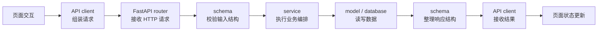
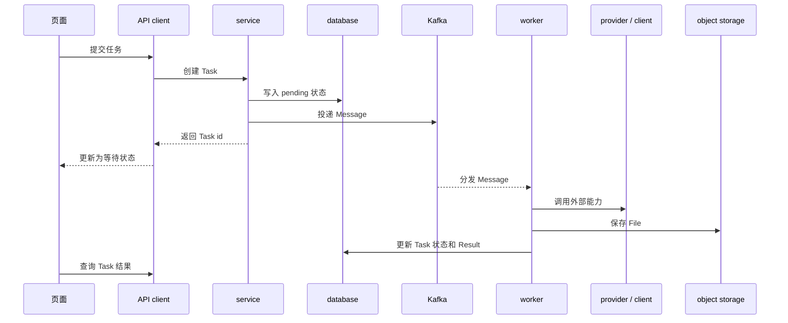
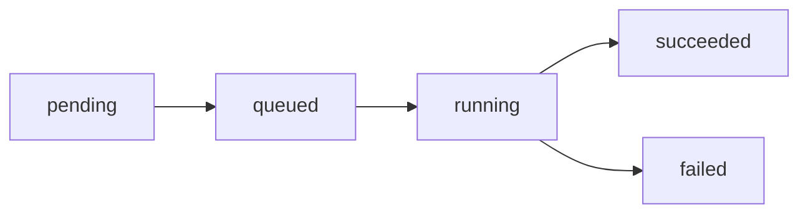

# 一次前后端架构与调用流程整理

最近维护一套前端和 Python 后端时，我对前后端分离这件事有了更清楚的感受。

它不只是把页面和接口放在两个目录里，而是要把每一层负责什么、数据怎么流动、任务什么时候同步返回、什么时候丢给后台处理想清楚。

## 技术栈概览

前端这一侧，我更关心的是页面、组件、状态、API client、Mock 和代理这些边界。

页面负责把用户操作组织成清楚的交互，组件负责复用和展示，状态管理负责让页面之间的数据变化可控，API client 则把请求细节收在一起。这样后端接口调整时，前端不会到处散落重复的请求逻辑。

后端这一侧，主要是 Python 方向：

- FastAPI 负责 HTTP 入口和路由组织。
- Pydantic 负责请求、响应和数据结构约束。
- SQLAlchemy 负责数据库模型和查询。
- Alembic 负责数据库迁移。
- PostgreSQL 负责持久化数据。
- Kafka 负责把耗时任务从同步请求里拆出去。
- 对象存储负责放文件、图片、视频等大对象。
- worker 负责消费任务、调用外部能力、更新状态。

这些东西拆开看都是独立工具，但真正写项目时，重点是让它们在同一条调用链里各自只做该做的事情。

## 后端分层

我现在更倾向于把后端按入口、结构、编排、存储和外部能力来分。

`router` 是 HTTP 入口，只处理路由、鉴权后的上下文、请求参数和响应出口。它不应该塞太多具体逻辑，否则接口多起来后会很难维护。

`schema` 用来描述输入和输出。它的价值不是多写几个类型，而是让前后端都知道“这个接口接受什么、返回什么、错误时大概是什么结构”。

`service` 放主要编排逻辑。比如创建任务、检查状态、写数据库、决定是否投递异步消息，都应该在这里组织。这样 router 可以薄一点，后面写测试或者换入口也更容易。

`model` 对应数据库结构。这里要稳定、明确，不能因为前端页面临时想要一个字段，就随手把结构揉在一起。

`provider` 或 `client` 更像外部能力的适配层。无论是调用模型服务、文件服务，还是别的 HTTP 服务，都应该把外部差异收在这里，不要让 service 到处感知不同平台的细节。

`worker` 负责异步执行。它不直接面向用户请求，而是从消息队列或任务表里拿工作，执行后再把状态写回去。

## 前后端同步调用流程

普通接口适合走同步链路。比如查询列表、保存配置、读取详情这类事情，前端发请求，后端处理完直接返回结果。

这条链路里，前端不应该关心数据库怎么查，后端也不应该关心按钮在哪里。双方真正共享的是接口契约。

我觉得这里最重要的是三件事：

- 请求参数要稳定，不要让前端靠猜。
- 错误结构要统一，不要每个接口一种格式。
- 返回数据要贴近页面需要，但不要把页面状态直接变成数据库结构。

## Kafka 异步调用流程

有些任务不适合在 HTTP 请求里一直等。

例如需要调用外部能力、处理文件、生成结果、上传对象存储，或者执行时间不稳定的任务，就更适合拆成“创建任务”和“后台处理”两段。

这条链路的重点不是“用了 Kafka”，而是把耗时和不稳定的部分从用户请求里拆出来。

HTTP 请求只负责确认任务已经创建。真正耗时的工作交给 worker。前端拿到任务 id 后，只需要根据状态展示“等待中、处理中、成功、失败”。

这样做的好处是：

- 页面不会被一个长请求卡住。
- 后端可以控制任务重试和失败状态。
- worker 可以独立扩展。
- 文件和大结果可以放到对象存储，不必塞进普通响应里。
- 后续排查问题时，可以沿着 Task 状态看链路走到哪一步。

## 状态和幂等

异步任务一多，状态设计就会变得很重要。

我会倾向于让任务状态保持清楚，比如：

每个状态都应该能回答一个问题：现在任务走到哪里了，用户应该看到什么，后端还会不会继续处理。

同时，创建任务和消费消息都要考虑幂等。网络重试、消息重复、worker 重启都可能发生。如果同一条消息被消费两次，系统也应该尽量不要生成两份结果，或者把状态写乱。

这里可以通过任务 id、状态检查、唯一约束、处理锁等方式降低问题概率。具体怎么做要看场景，但这个意识本身很重要。

## 前后端边界

维护到后面，我会越来越在意边界。

前端应该负责：

- 页面状态和交互节奏。
- 表单校验和基础提示。
- API client 封装。
- 错误展示和加载状态。
- Mock 或代理环境下的联调体验。

后端应该负责：

- 数据结构和核心规则。
- 权限、状态流转和一致性。
- 数据库读写。
- 外部能力适配。
- 异步任务、重试和最终状态。

如果前端为了赶页面，把后端规则也复制一份，后面就容易两边不一致。如果后端把所有页面展示细节都塞进接口里，接口也会变得很难复用。

好的边界不是完全不重叠，而是知道哪些地方可以重复一点，哪些地方必须只有一个权威来源。

## 我现在的理解

这类架构最核心的不是某一个框架，而是调用链路能不能被说清楚。

一个请求从页面发出后，经过了哪个 API client、进了哪个 router、由哪个 service 编排、写了什么状态、什么时候投递消息、worker 怎么接手、结果怎么回到页面，这些都应该能顺着讲明白。

能讲清楚，才说明自己不是只在改某一小块代码，而是真的知道这个系统为什么这样拆、出了问题应该从哪里查、以后要扩展时应该往哪里放。

这也是我现在维护前端和 Python 后端时，觉得最有价值的一点。

:badge[Python] :badge[FastAPI] :badge[Kafka] :badge[前后端分离]
