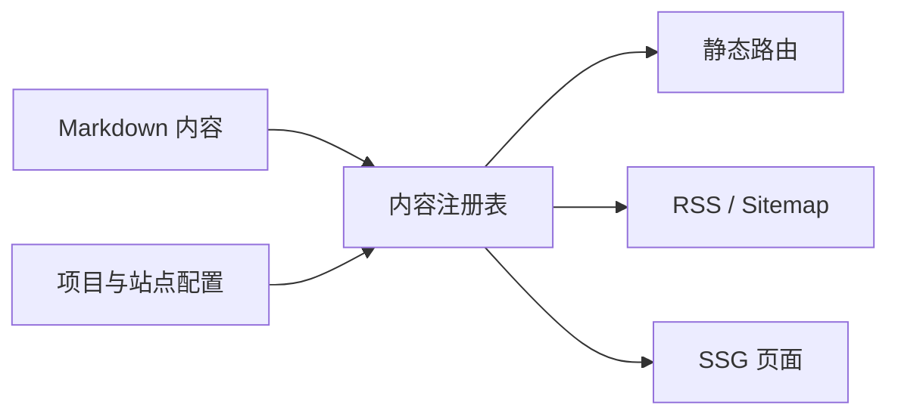

# 构建这个双语静态站

Ying Blog 当前已经实现的目标不是追求复杂平台，而是建立一个可以长期维护的静态内容系统。它覆盖博客、文档、项目展示和关于页，并且让中文与英文内容保持结构一致。

::: callout info
这不是 VitePress 项目。站点使用 Vite+ 作为工具链方向，应用层由 Vue、TypeScript、SSG 和 Markdown 内容系统组成。
:::

## 为什么使用内容注册表

所有公开页面都应该来自同一份规范化内容数据。这样可以避免路由、导航、SEO、RSS 和 sitemap 各自实现一套规则。

```ts
export interface ContentEntry {
  locale: "zh" | "en";
  slug: string;
  title: string;
  description: string;
  path: string;
}
```

内容注册表会在构建前检查 slug、locale、标题、描述、日期、分类和标签。缺少对应语言内容时，构建会失败。



## 读者体验优先

这个站点的视觉方向是安静、清晰和易读，而不是营销式 landing page。文档页应该适合快速扫描，文章页应该适合长时间阅读。

:::: tabs
::: tab "浅色模式"
浅色模式保持明亮背景、清楚边界和温和强调色，优先服务长文阅读。
:::

::: tab "暗色模式"
暗色模式降低大面积对比度，同时保证代码块、链接和导航状态可辨识。
:::
::::

## 当前实现边界

:::: steps
::: step "内容入口"
Posts、Docs 和 About 由 Markdown 驱动，Projects 由集中配置驱动卡片展示。
:::

::: step "构建输出"
构建会生成静态 HTML、RSS、sitemap、robots 和 404 页面，并通过验证脚本检查关键产物。
:::

::: step "受控能力"
CMS、评论、分析、搜索、草稿、生成社交图和项目详情页不属于当前实现范围。
:::
::::

:badge[Vue] :badge[TypeScript] :badge[SSG]
